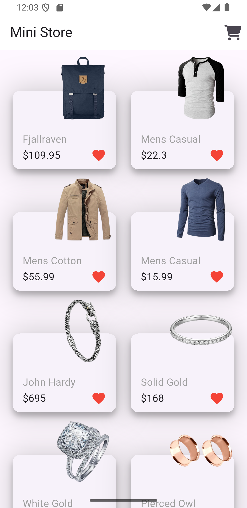
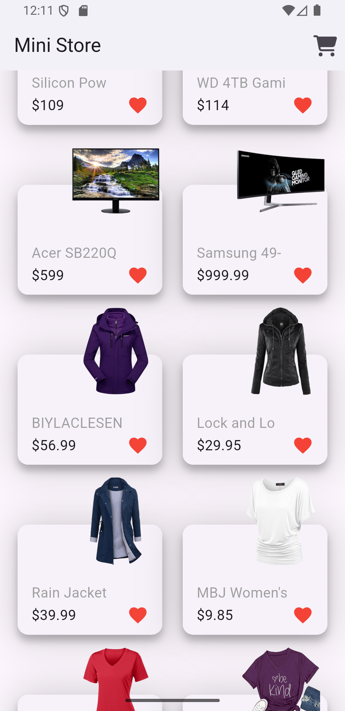
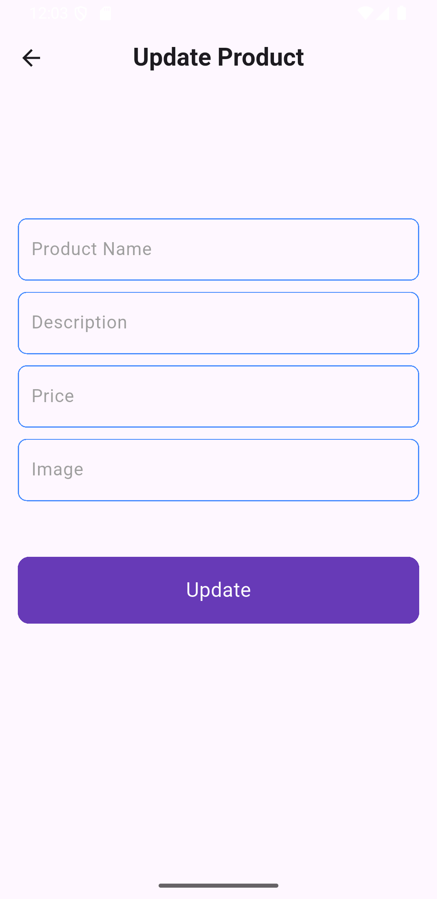

# 🛒 Mini Store App - Flutter

A **learning project** built with **Flutter** to practice working with APIs and implement basic store-related features.  
This app is designed to help beginners understand how to fetch and display data from APIs, handle product details, and create a simple store interface in Flutter.

---

## 🚀 Features

- 🛍️ Display products in an organized and attractive layout  
- 📄 Product detail page for each item  
- 🌐 Fetch product data from an API  
- 🎨 Simple and interactive UI design  
- ⚡ Fast performance and smooth navigation  
- 🛠️ Easy to customize and extend  

---

## 📸 App Screenshots

<p align="center">
  
  
  
</p>

---

## 🛠️ Technologies Used

- **Flutter** 🐦  
- **Dart**  
- **REST API** for fetching product data  

---

## 📂 Project Structure

```
lib/
├── models/           # Data models (e.g., Product model)
├── pages/            # Screens: home, product details
├── widgets/          # Custom UI components
├── main.dart         # App entry point
```

---

## 📝 How to Use

1. **Clone the repository**:
   ```bash
   git clone https://github.com/sahiralzakaria/Flutter-Learning-Apps-Mini-Store-App.git
   cd Flutter-Learning-Apps-Mini-Store-App
   ```

2. **Install dependencies**:
   ```bash
   flutter pub get
   ```

3. **Run the app**:
   ```bash
   flutter run
   ```

---

## 👨‍💻 Author

**Sahir Zakaria**

- 📧 Feel free to reach out for any questions or suggestions  
- 🔗 Connect with me on social media  
- ⭐ If you found this project helpful, please give it a star!  

- [](https://github.com/sahiralzakaria) **GitHub:** [sahiralzakaria](https://github.com/sahiralzakaria)  
- [](https://www.linkedin.com/in/sahir-zakaria-39873531b) **LinkedIn:** [sahir-zakaria](https://www.linkedin.com/in/sahir-zakaria-39873531b)  
- [](mailto:sahir.alzakaria@gmail.com) **Email:** sahir.alzakaria@gmail.com  

---

<div align="center">
  <p>Made with ❤️ by <strong>Sahir Zakaria</strong></p>
  <p><em>Happy Coding! 🚀</em></p>
</div>
